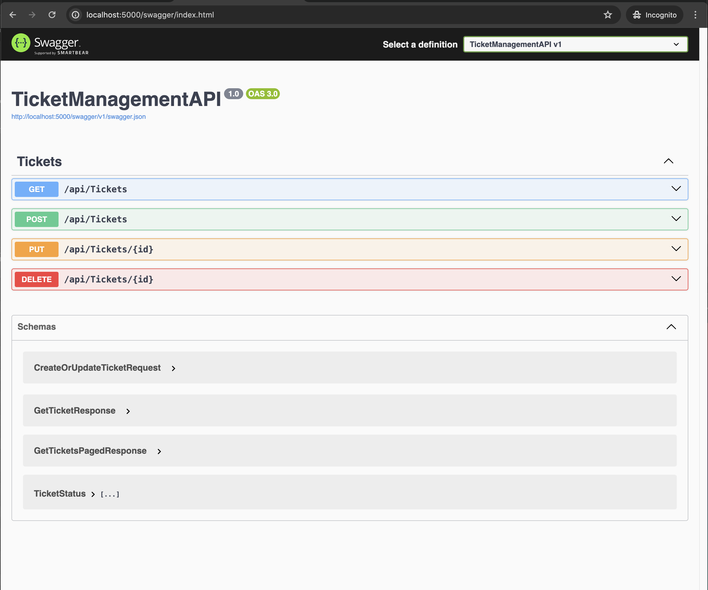
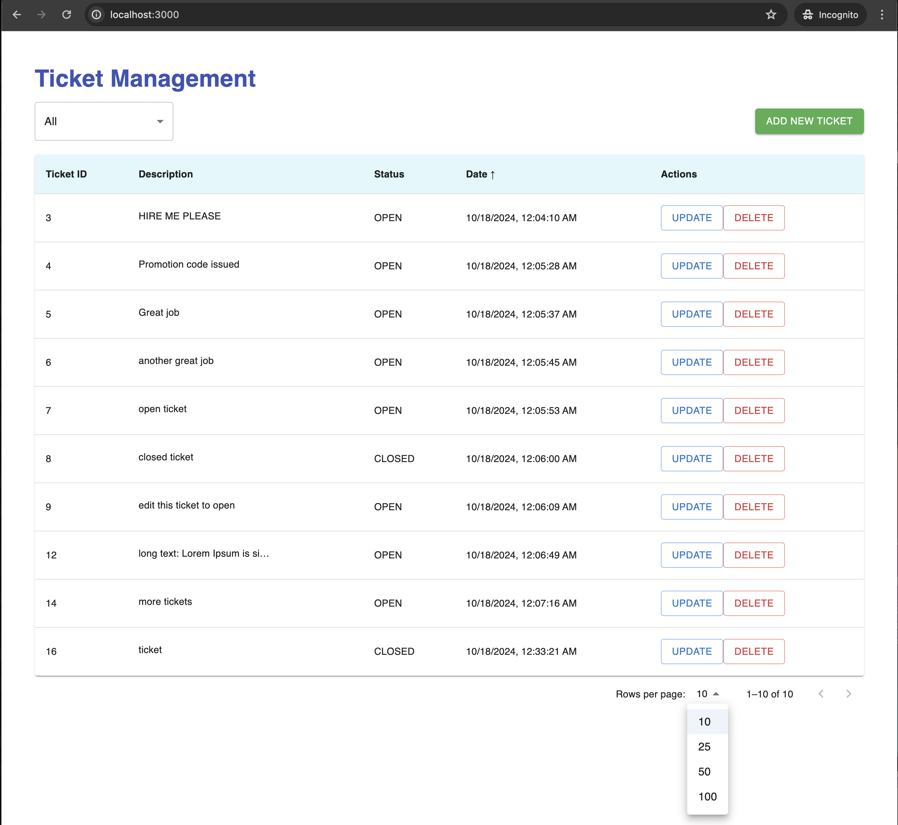
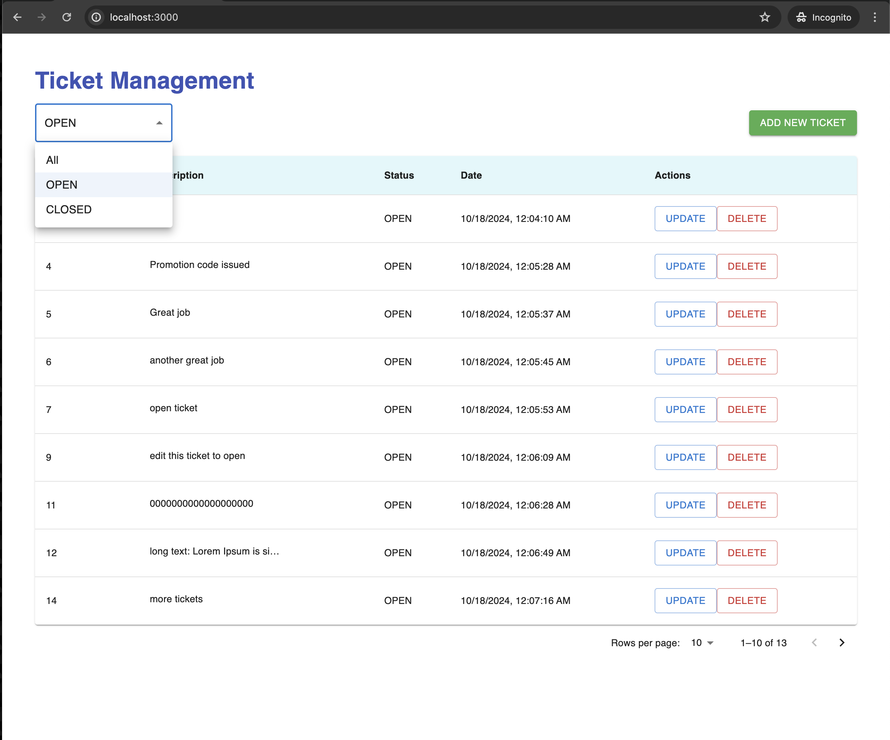
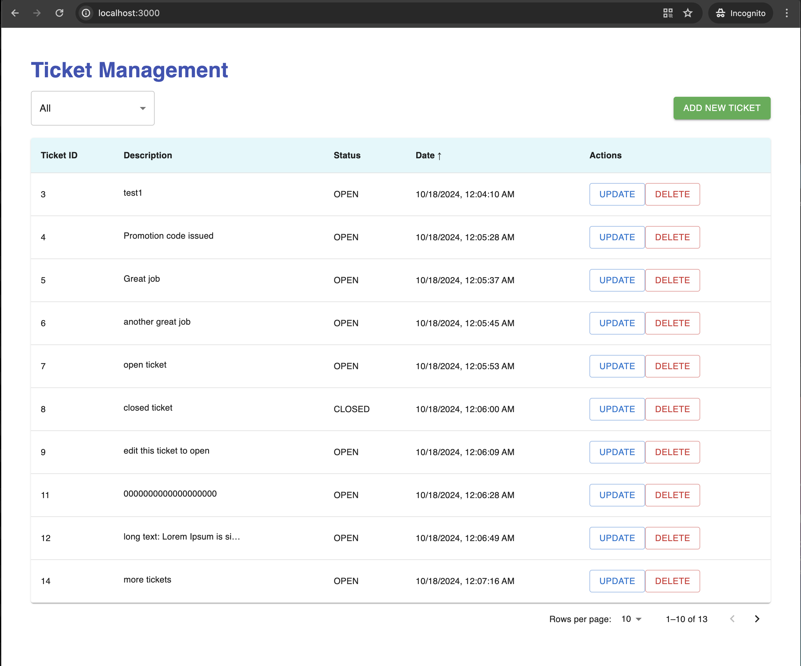

# Ticket Management System

This repository contains a Ticket Management System with a frontend (React) and backend (.NET 8) for managing support tickets.


## Technologies

### Frontend
- **React 18**
- **Node.js 18**
- **Bootstrap 5** (for styling)

### Backend
- **.NET 8**
- **Entity Framework Core** (EF Core) for database access
- **PostgreSQL** for the database
- **Docker** for containerization
- **Swagger** for API documentation

## Prerequisites

- **Docker** and **Docker Compose** (for containerized environment)

   Ensure that these are installed and running on your machine.

## Clone and Run the Application

1. **Clone the Repository**

   ```bash
   git clone git@github.com:a-boudoun/hahn-software-Task-Fullstack-Developer.git ticket-management-system
   cd ticket-management-system
   docker-compose up --build

2. **Accessing the Application**

   - Frontend (React): Open your browser and go to http://localhost:3000
   - Backend (Swagger API Documentation): Visit http://localhost:5000/swagger to see the API documentation.


## Backend Design Patterns

The backend follows some key design patterns:

**Repository Pattern**: The data access layer is abstracted using repositories. Each entity has a corresponding repository interface (e.g., ITicketRepository) and implementation (TicketRepository).

**Service Layer Pattern**: Business logic is encapsulated within services, providing a separation between the controller and data access layers. For example, ITicketService and TicketService handle ticket-related operations.

**Dependency Injection**: The application makes use of .NET Core's built-in dependency injection for injecting services and repositories.

**Database Migrations**: Entity Framework Core migrations are used for managing database schema changes.

**Swagger Documentation**
The backend API is documented using Swagger, providing an interactive way to explore the API. Here is a screenshot of the Swagger UI:




## Frontend Features

The frontend is built with React and provides the following features:

- **List All Tickets**: Displays a paginated list of all support tickets.


- **Edit or Delete Ticket**: Users can modify or remove existing tickets.




- **Filter by Ticket Status**: Users can filter tickets based on their status (open or closed).




- **Add New Ticket**: Includes a button to add a new ticket, with inputs that are validated.


- **Sorting**: The ticket table can be sorted by Ticket ID or Date by clicking on the respective table headers.


